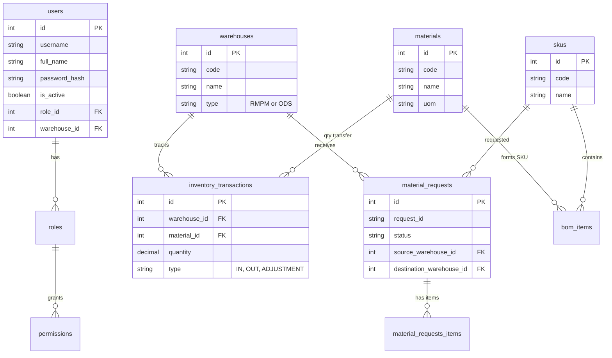

# Database Architecture

The FMCG WMS utilizes a relational database (PostgreSQL 16) built on the principles of Domain-Driven Design and a strict ledger-based inventory system.

## Entity-Relationship Diagram (ERD)

## Base Model Principles
All domain models inherit from an `AuditedModel` which includes:
- `id`: Integer Primary Key
- `public_id`: UUID for external API references (prevents enumeration).
- `version`: Integer for optimistic locking.
- `created_at` / `updated_at` / `deleted_at`: Soft delete timestamps.
- `created_by` / `updated_by` / `deleted_by`: User ID tracking.

## Ledger-Based Inventory
Inventory balances are not overwritten. Instead, every movement is recorded in `inventory_transactions`. The current available stock is `SUM(quantity)` where `type = IN` minus `type = OUT`. This guarantees complete traceability.
