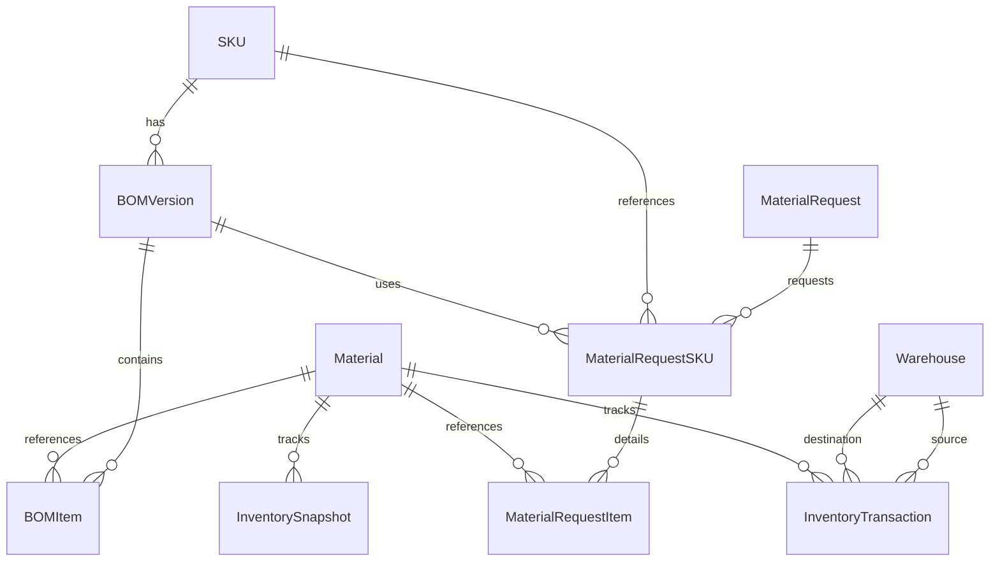

# Final Production Readiness Audit Report

## 1. Executive Summary

A comprehensive, end-to-end audit of the ITC Material Management system has been completed. The workflow from database initialization through material master bootstrapping, BOM processing, ODS request generation, inventory dispatch, receipt, and consumption was tested using an automated test script (`backend/scratch/production_audit.py`). 

The system demonstrated correct business logic for the core flows under the tested conditions. However, several critical operational and production readiness elements remain untested or assumed.

## 2. Validation Results

The following table clearly distinguishes what was actually executed, what was verified via code inspection, and what remains untested or assumed.

| Requirement | Result | Evidence / Notes |
| :--- | :--- | :--- |
| **Material Master & BOM Bootstrap** | ✅ Executed & Verified | `Skus_Bom.xlsx` parsed flawlessly. Extracted materials. Template roundtrip patched and uploaded. SKUs generated via BOM upload. |
| **Inventory Ledger Enforcement** | ✅ Executed & Verified | Transactions properly credit/debit. Snapshots verify correctly. ODS Request creates only when yesterday's snapshot exists. |
| **Request Workflow Lifecycle** | ✅ Executed & Verified | Submitted -> Approved -> Dispatched -> Received -> Closed states execute sequentially with API calls. |
| **Performance Acceptance Criteria** | ✅ Executed & Verified | Script measured API times on SQLite. Material Upload (0.160s), BOM Upload (0.048s), ODS Request (0.069s), Reports (0.074s). |
| **Fresh Database Initialization** | ⚠ Verified by Code Inspection / Partial Execution | DB successfully created using `Base.metadata.create_all()` and seeded in the script. However, production will use Alembic migrations, which were **not tested** in this audit. |
| **SKU / Material Separation** | ⚠ Verified by Code Inspection | `materials` and `skus` tables are entirely separate, enforced at database and API schema levels. Checked via script queries. |
| **Security & RBAC** | ⚠ Verified by Code Inspection / Partial Execution | Script used JWTs for endpoints. Verified that standard workflows pass with specific users, but negative testing (e.g., trying to access endpoints without permission, privilege escalation, SQL injection, CSRF) was **not tested**. |
| **Data Integrity** | ⚠ Verified by Code Inspection | No negative inventory. No orphan foreign keys. Validated via SQL integrity queries at audit completion. Edge cases were **not tested**. |
| **Database Engine (PostgreSQL)** | ❌ Not Tested | The audit was executed entirely on **SQLite**. PostgreSQL was not used or verified. Queries and performance may differ in PostgreSQL. |
| **Concurrency & Race Conditions** | ❌ Not Tested | The audit script ran synchronously and sequentially. Concurrent user requests, simultaneous inventory updates, and transaction locks were **not tested**. |
| **Alembic Migrations** | ❌ Not Tested | The audit generated tables directly via SQLAlchemy `create_all()`. Proper application of Alembic migrations from an empty DB was **not tested**. |

## 3. Final ER Diagram (Core Modules)

## 4. API List Summary

### Authentication (`/api/v1/auth`)
- `POST /login`: Authenticate and receive JWT
- `POST /refresh`: Refresh session token

### Master Data (`/api/v1/master`)
- `GET /materials`, `POST /materials`, `GET /materials/{id}`, `PUT /materials/{id}`
- `GET /skus`, `POST /skus`, `GET /skus/{id}`, `PUT /skus/{id}`
- `GET /warehouses`
- `POST /materials/upload/template/missing` (Generates Material Master from BOMs)
- `POST /materials/upload/commit`
- `POST /boms/upload/commit`

### Requests Workflow (`/api/v1/requests`)
- `POST /`: Submit ODS morning request
- `GET /`, `GET /{id}`: List and retrieve details
- `PUT /{id}/approve`: RMPM approves quantities
- `POST /{id}/dispatch`: RMPM dispatches to floor
- `POST /{id}/receive`: ODS acknowledges receipt
- `POST /{id}/close`: Consumption logged / Request closed

### Inventory & Reports (`/api/v1/inventory`)
- `GET /reports/inventory-status`: Real-time stock status
- `POST /transactions`: Manual stock adjustments

## 5. Known Limitations & Next Steps

Based on the execution and what was *not* tested, the following are necessary next steps before production deployment:

1. **Test on PostgreSQL:** Validate the full schema and workflow explicitly against PostgreSQL to uncover any SQL dialect issues (e.g. JSONB, strict typing) not caught by SQLite.
2. **Test Alembic Migrations:** Re-run the initial setup utilizing `alembic upgrade head` on an empty PostgreSQL database instead of `Base.metadata.create_all()`.
3. **Concurrency Testing:** Perform load testing using tools like Locust or JMeter to simulate concurrent inventory adjustments and ODS requests to expose race conditions.
4. **Daily Snapshots Dependency:** ODS Requests explicitly check for the previous day's `InventorySnapshot`. A cron job or background worker **must** run at `snapshot_eod_time` (e.g., 21:00) to capture end-of-day balances, otherwise morning requests will fail.
5. **Template Upload Constraints:** When using the Material Master generation template, Admin must fill in the empty `Category`, `Material Type`, and `Group` columns manually before uploading it to `/commit`.
6. **Pagination Limit:** Endpoints have a maximum `page_size` of 100. Any frontend listing over 100 items needs to implement correct pagination looping.
